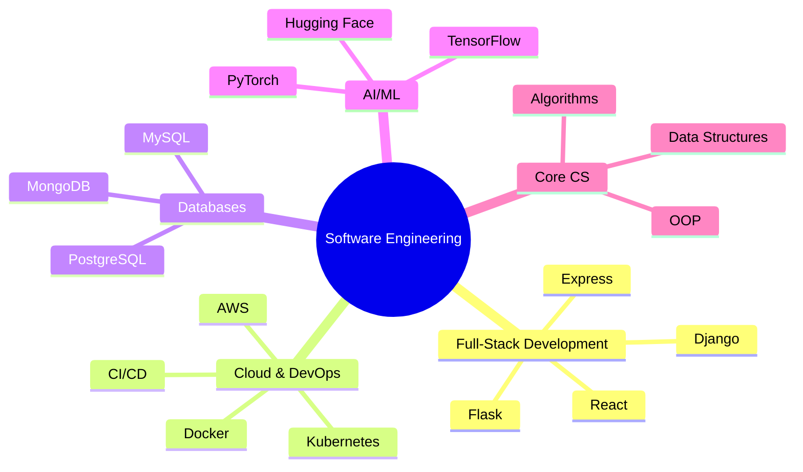

  

  

    
  

  
  
  

## 💻 Aspiring Full-Stack Software Engineer  

I’m passionate about building **modern, scalable web applications** and learning best practices across the stack. My focus areas include:  

- 🌐 **Frontend** – React, JavaScript, HTML, CSS, responsive design  
- 🖥️ **Backend & APIs** – Django, Flask, Express, RESTful APIs  
- 🗄️ **Databases** – PostgreSQL, MongoDB, MySQL  
- ☁️ **Cloud & DevOps** – AWS, Docker, Kubernetes, CI/CD pipelines  
- 🤖 **AI/ML Integration** – TensorFlow, PyTorch, Hugging Face (bonus for intelligent features)  

Currently building **full-stack applications** with a focus on **scalable, maintainable, and production-ready systems**.  

---

## 💻 About Me  

- 🔭 Currently working on **a Kanban style Trello Clone** and **cloud-native full-stack apps**  
- 🌱 Learning **AWS, Kubernetes, Docker, and DevOps workflows**  
- 👯 Open to collaborating on **AI, full-stack web, or cloud-native systems**  
- ⚡ Fun fact: Built a **full e-commerce platform** that scaled to 500+ orders in < 12 months!  

---

## 🛠️ Core Competencies  

### 🚀 Software Development & Systems

### ⚙️ Tech Stack  

<table>
  <tr>
    <td align="center" width="100">
      
       Python
    </td>
    <td align="center" width="100">
      
       Java
    </td>
    <td align="center" width="100">
      
       C++
    </td>
    <td align="center" width="100">
      
       JavaScript
    </td>
    <td align="center" width="100">
      
       React
    </td>
    <td align="center" width="100">
      
       Django
    </td>
  </tr>
  <tr>
    <td align="center" width="100">
      
       Flask
    </td>
    <td align="center" width="100">
      
       Docker
    </td>
    <td align="center" width="100">
      
       Kubernetes
    </td>
    <td align="center" width="100">
      
       MySQL
    </td>
    <td align="center" width="100">
      
       MongoDB
    </td>
    <td align="center" width="100">
      
       Git
    </td>
  </tr>
</table>

---

## 📂 Featured Projects  

- 🔹 **AI-Powered ATS Clone** – Resume analyzer + tracking system with AI feedback → [Repo](https://github.com/kashali26/AI-Powered-ATS-Clone)  
- 🔹 **Dealer Insights Web App** – Django + React app with analytics, deployed on Kubernetes + IBM Cloud → [Repo](https://github.com/kashali26/Dealer_Insights_Web_App)  
- 🔹 **Course Scheduling Web App** – PostgreSQL-backed dynamic course management system → [Repo](https://github.com/kashali26/Course_Scheduling_Web_App_EZU)  

👉 More projects on my [GitHub](https://github.com/kashali26?tab=repositories)  

---

## 📊 GitHub Activity  

---

## 🤝 Let’s Connect  

I’m always excited to collaborate on:  
- 🌐 **Full-Stack Web Apps**  
- ☁️ **Cloud-Native Projects**  
- 🤖 **AI/ML Tools and Systems**  

💡 Let’s build impactful software together!  

