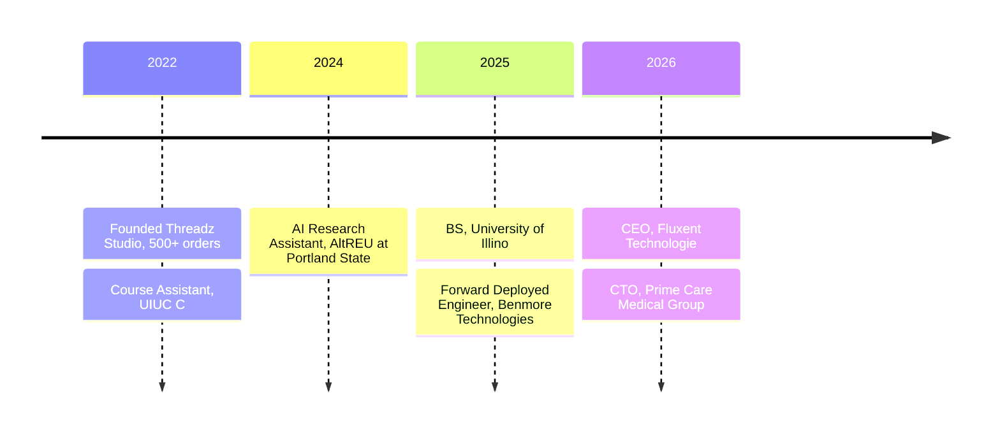
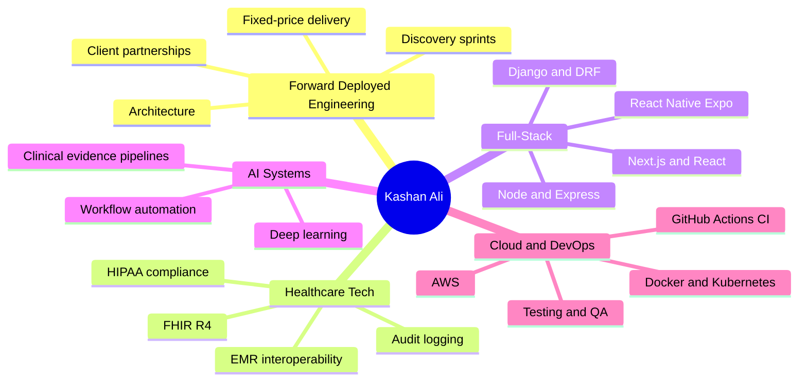

 

 

## About

I'm a full-stack engineer who builds intelligent systems and production software for healthcare,  fintech, and SaaS companies. I workngineer**: I embed with the team,figure out what actually needs to be built, and ship it.                                         
UIUC graduate, BS in Information Science & Computer Science. IBM Full Stack Software Developer    and IBM AI Developer certified.
                                                                                                  

<table>                                                                                             <tr>
    <td align="center" width="180"><h2>10+</h2>enterprise client engagements             led</td>
    <td align="center" width="180"><h2>$600K+</h2>in fixed-price contracts               delivered</td>
    <td align="center" width="180"><h2>10</h2>health and marketplace platforms in        progress</td>
    <td align="center" width="180"><h2>~3 mo</h2>typical idea to production              timeline</td>
  </tr>                                                                                           </table>

                                                                                           
                                                                                             
## Currently                                                                                     
<table>                                                                                             <tr>
    <td width="50%" valign="top">                                                                                                                                                   <h3>CEO / Founding Forward De
      Jun 2026 to Present &nbsp;·&nbsp; <a                                                   href="https://fluxent.tech">fluxent
      <ul>                                                                                                <li>Engineering firm that eectly inside client teams</li>
        <li>Fixed-price, milestone-billed delivery in ~3 months vs. the typical 6 to 12 month     agency cycle</li>
        <li>Internal tools, web and mobile apps, AI automation, and integrations (Stripe, EHRs,   Salesforce, HubSpot)</li>
        <li>Clients keep full code and IP ownership</li>                                                </ul>
    </td>                                                                                             <td width="50%" valign="top">
      
      <h3>CTO & Senior Forward Deployed Engineer</h3>
      Jun 2026 to Present &nbshref="https://www.primecarenyc.com/">primecarenyc.com</a>
      <ul>
        <li>Leading architecture for a 10-platform digital health and marketplace portfolio</li>
        <li>HIPAA-compliant chart rmedical evidence synthesis</li>
        <li>EMR interoperability via Particle Health and Health Gorilla</li>
        <li>Every clinical workflowver autonomous</li>
      </ul>
    </td>
  </tr>
</table>

<b>Prime Care platform portfolio</b>

 

| Digital Health | | Marketplaces |
|---|---|---|---|
| **PrimeSkin.AI** | Consumer skin- | Commission-free real estate, 7languages |
| **SecondOpinionMedical.AI** | D2Cs | **MedicalLaser.com** | Medicallaser equipment |
| **EvidenceFlow.AI** | Physician-st | **HalalCatering.com** | Halalcatering marketplace |
| **ChartLink.AI** | FHIR records aems | **WorldPhysicians.com** |Global physician network |

 

## Career Path

```mermaid
timeline
    2022 : Founded Threadz Studio, 500+ orders
         : Course Assistant, UIUC C
    2024 : AI Research Assistant, AltREU at Portland State
    2025 : BS, University of Illino
         : Forward Deployed Engineer, Benmore Technologies
    2026 : CEO, Fluxent Technologie
         : CTO, Prime Care Medical Group
```

<b>Previous roles in detail</b>

 

| Role | Company | Dates | Highligh
|---|---|---|---|
| **Forward Deployed Engineer / Tecogies | Dec 2025 to Jun 2026 | Led10+ concurrent client builds. Architected HIPAA telehealth and EHR platforms (Auth0, MFA,
AES-256-GCM, FHIR R4). Raised produm ~50 to 85+/100 |
| **AI Developer / Research Assistant** | AltREU, Portland State | May to Aug 2024 | Pneumonia
detection on 35,000+ chest X-rays. d-CAM explainability. Peer-reviewedpublication |
| **Course Assistant, CS 124** | UI| Supported 1,000+ students in Java, Kotlin, OOP, and data structures |
| **Founder / Full-Stack Engineer** Oct 2022 | Custom apparele-commerce platform scaled to 500+ orders in 12 months |

 

## Core Competencies

```mermaid
mindmap
  root((Kashan Ali))
    Forward Deployed Engineering
      Discovery sprints
      Architecture
      Fixed-price delivery
      Client partnerships
    Healthcare Tech
      HIPAA compliance
      FHIR R4
      EMR interoperability
      Audit logging
    Full-Stack
      Django and DRF
      Next.js and React
      React Native Expo
      Node and Express
    AI Systems
      Clinical evidence pipelines
      Deep learning
      Workflow automation
    Cloud and DevOps
      Docker and Kubernetes
      AWS
      GitHub Actions CI
      Testing and QA
```

 

## Tech Stack

<table>
  <tr>
    <td align="right" width="130"><
    <td></td>
  </tr>
  <tr>
    <td align="right"><b>Frontend</b></td>
    <td></td>
  </tr>
  <tr>
    <td align="right"><b>Backend</b
    <td></td>
  </tr>
  <tr>
    <td align="right"><b>Databases</b></td>
    <td></td>
  </tr>
  <tr>
    <td align="right"><b>Cloud & De
    <td></td>
  </tr>
</table>

 

**Integrations**

**Testing & Quality**

 

## Client Work

Source code is private under client agreements.

<table>
  <tr>
    <td width="50%" valign="top">
      <h3>MyMed Access</h3>
      BELLE MEDICAL GROUP
      
Multi-clinic telehealth EHR document intake, and encrypted QRsharing of patient data. 14,300+ tests at over 85% coverage.

      <imgsrc="https://img.shields.io/badge/Django-092E20?style=flat-square&logo=django&logoColor=white"/>
      
      
      <imgsrc="https://img.shields.io/badge/Auth0-EB5424?style=flat-square&logo=auth0&logoColor=white"/>
      
    </td>
    <td width="50%" valign="top">
      <h3>Echelon NIL Platform</h3>
      PRIVATE CLIENT
      
Athlete compliance and wealth platform. Automates LLC formation, S-Corp election,
payroll, and payouts. Cut athlete o 2 weeks.

      
      
      
      
      <imgsrc="https://img.shields.io/badge/Twilio-F22F46?style=flat-square&logo=twilio&logoColor=white"/>
    </td>
  </tr>
  <tr>
    <td width="50%" valign="top">
      <h3>MeasuredHRIS</h3>
      PRIVATE CLIENT
      
Multi-tenant restaurant HRoll, row-level tenant isolation, and a compliance engine covering 7 jurisdictions.

      <imgsrc="https://img.shields.io/badge/Django-092E20?style=flat-square&logo=django&logoColor=white"/>
      
      
      <imgsrc="https://img.shields.io/badge/Celery-37814A?style=flat-square&logo=celery&logoColor=white"/>
    </td>
    <td width="50%" valign="top">
      <h3>Aaniin Marketplace</h3>
      PRIVATE CLIENT
      
Indigenous vendor marketplL fulfillment, and manufacturinginto one source of truth. 5-role access control and a product mockup builder.

      <imgsrc="https://img.shields.io/badge/Django-092E20?style=flat-square&logo=django&logoColor=white"/>
      
      
      
    </td>
  </tr>
  <tr>
    <td colspan="2" valign="top">
      <h3>Acumen Estimation SaaS &nsrc="https://img.shields.io/badge/LIVE-22C55E?style=flat-square"/></h3>
      ACUMEN RENOVATIONS
      
Construction quoting SaaS that turns ~1,000 pricing formulas into instant PDF quotes,
with white-label onboarding for con
      <a href="https://visualestimate.build">visualestimate.build</a> · <a
href="https://acumenrenovations.com>

      
      
      
      
      
    </td>
  </tr>
</table>

 

## Open Source

<table>
  <tr>
    <td width="33%" valign="top">
      <h4><a href="https://github.cS-Clone">AI-Powered ATSClone</a></h4>
      
Scores resumes against jobtionable feedback.

      
      
    </td>
    <td width="33%" valign="top">
      <h4><a href="https://github.com/kashali26/Dealer_Insights_Web_App">Dealer Insights</a></h4>
      
AI sentiment analysis on cship operations.

      
      
    </td>
    <td width="33%" valign="top">
      <h4><a href="https://github.com/kashali26/Course_Scheduling_Web_App_EZU">Course Scheduling
App</a></h4>
      
Course assignments, instructor allocation, and semester planning.

      <imgsrc="https://img.shields.io/badge/Django-092E20?style=flat-square&logo=django&logoColor=white"/>
      
    </td>
  </tr>
</table>

 

## GitHub Activity

 

## Let's Connect

Building something and need it shiponversation about product, AI, orhealthcare tech.

[](mailto:kashali2
[](https://www.linkedin.c

