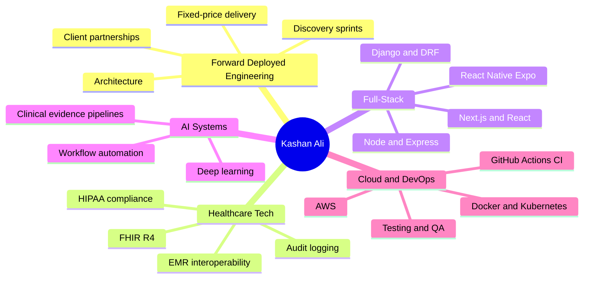

 

 

## About

I'm a full-stack engineer who builds intelligent systems and production software for healthcare, fintech, and SaaS companies. I work as a **forward deployed engineer**: I embed with the team, figure out what actually needs to be built, and ship it.

UIUC graduate, BS in Information Science & Computer Science. IBM Full Stack Software Developer and IBM AI Developer certified.

<table>
  <tr>
    <td align="center" width="180"><h3>10+</h3>enterprise client engagements led</td>
    <td align="center" width="180"><h3>$600K+</h3>in fixed-price contracts delivered</td>
    <td align="center" width="180"><h3>10</h3>health and marketplace platforms in progress</td>
    <td align="center" width="180"><h3>~3 mo</h3>typical idea to production timeline</td>
  </tr>
</table>

 

## Currently

<table>
  <tr>
    <td width="50%" valign="top">
      
        
      <b>CEO / Founding Forward Deployed Engineer</b> 
      Jun 2026 to Present &nbsp;·&nbsp; <a href="https://fluxent.tech">fluxent.tech</a>
      <ul>
        <li>Engineering firm that embeds senior engineers directly inside client teams</li>
        <li>Fixed-price, milestone-billed delivery in ~3 months vs. the typical 6 to 12 month agency cycle</li>
        <li>Internal tools, web and mobile apps, AI automation, and integrations (Stripe, EHRs, Salesforce, HubSpot)</li>
        <li>Clients keep full code and IP ownership</li>
      </ul>
    </td>
    <td width="50%" valign="top">
      
        
      <b>CTO & Senior Forward Deployed Engineer</b> 
      Jun 2026 to Present &nbsp;·&nbsp; <a href="https://www.primecarenyc.com/">primecarenyc.com</a>
      <ul>
        <li>Leading architecture for a 10-platform digital health and marketplace portfolio</li>
        <li>HIPAA-compliant chart retrieval and multi-engine medical evidence synthesis</li>
        <li>EMR interoperability via Particle Health and Health Gorilla</li>
        <li>Every clinical workflow is physician-reviewed, never autonomous</li>
      </ul>
    </td>
  </tr>
</table>

<b>Prime Care platform portfolio</b>

 

| Platform | Focus | Platform | Focus |
|---|---|---|---|
| **PrimeSkin.AI** | Consumer skin-health AI | **Jaidad.com** | Commission-free real estate, 7 languages |
| **SecondOpinionMedical.AI** | D2C telehealth second opinions | **MedicalLaser.com** | Medical laser equipment |
| **EvidenceFlow.AI** | Physician-supervised clinical co-pilot | **HalalCatering.com** | Halal catering marketplace |
| **ChartLink.AI** | FHIR records across ~160,000 health systems | **WorldPhysicians.com** | Global physician network |

 

## Career Path

<table>
  <tr>
    <td align="center" width="20%"><b>2022</b></td>
    <td align="center" width="20%"><b>2022 to 2023</b></td>
    <td align="center" width="20%"><b>2024</b></td>
    <td align="center" width="20%"><b>2025 to 2026</b></td>
    <td align="center" width="20%"><b>2026 to Now</b></td>
  </tr>
  <tr>
    <td align="center" valign="top">Founder Threadz Studio</td>
    <td align="center" valign="top">Course Assistant UIUC CS 124</td>
    <td align="center" valign="top">AI Research Assistant AltREU, Portland State</td>
    <td align="center" valign="top">Forward Deployed Engineer Benmore Technologies</td>
    <td align="center" valign="top">CEO and CTO Fluxent and Prime Care</td>
  </tr>
</table>

<b>Previous roles in detail</b>

 

| Role | Company | Dates | Highlights |
|---|---|---|---|
| **Forward Deployed Engineer / Tech Lead** | Benmore Technologies | Dec 2025 to Jun 2026 | Led 10+ concurrent client builds. Architected HIPAA telehealth and EHR platforms (Auth0, MFA, AES-256-GCM, FHIR R4). Raised production-readiness scores from ~50 to 85+/100 |
| **AI Developer / Research Assistant** | AltREU, Portland State | May to Aug 2024 | Pneumonia detection on 35,000+ chest X-rays. Cut training time 45%. Grad-CAM explainability. Peer-reviewed publication |
| **Course Assistant, CS 124** | UIUC | Aug 2022 to May 2023 | Supported 1,000+ students in Java, Kotlin, OOP, and data structures |
| **Founder / Full-Stack Engineer** | Threadz Studio | Jan to Oct 2022 | Custom apparel e-commerce platform scaled to 500+ orders in 12 months |

 

## Core Competencies

```mermaid
mindmap
  root((Kashan Ali))
    Forward Deployed Engineering
      Discovery sprints
      Architecture
      Fixed-price delivery
      Client partnerships
    Healthcare Tech
      HIPAA compliance
      FHIR R4
      EMR interoperability
      Audit logging
    Full-Stack
      Django and DRF
      Next.js and React
      React Native Expo
      Node and Express
    AI Systems
      Clinical evidence pipelines
      Deep learning
      Workflow automation
    Cloud and DevOps
      Docker and Kubernetes
      AWS
      GitHub Actions CI
      Testing and QA
```

 

## Tech Stack

<table>
  <tr>
    <td align="right" width="140"><b>Languages</b></td>
    <td></td>
  </tr>
  <tr>
    <td align="right"><b>Frontend</b></td>
    <td></td>
  </tr>
  <tr>
    <td align="right"><b>Backend</b></td>
    <td></td>
  </tr>
  <tr>
    <td align="right"><b>Databases</b></td>
    <td></td>
  </tr>
  <tr>
    <td align="right"><b>Cloud and DevOps</b></td>
    <td></td>
  </tr>
</table>

 

<b>Integrations</b>
  

  

<b>Testing and Quality</b>
  

 

## Client Work

Source code is private under client agreements.

<table>
  <tr>
    <td width="50%" valign="top">
      <b>MyMed Access</b> 
      BELLE MEDICAL GROUP
      
Multi-clinic telehealth EHR with FHIR R4 records, OCR document intake, and encrypted QR sharing of patient data. 14,300+ tests at over 85% coverage.

      
      
      
      
      
    </td>
    <td width="50%" valign="top">
      <b>Echelon NIL Platform</b> 
      PRIVATE CLIENT
      
Athlete compliance and wealth platform. Automates LLC formation, S-Corp election, payroll, and payouts. Cut athlete onboarding from 4 months to 2 weeks.

      
      
      
      
      
    </td>
  </tr>
  <tr>
    <td width="50%" valign="top">
      <b>MeasuredHRIS</b> 
      PRIVATE CLIENT
      
Multi-tenant restaurant HR system with embedded payroll, row-level tenant isolation, and a compliance engine covering 7 jurisdictions.

      
      
      
      
    </td>
    <td width="50%" valign="top">
      <b>Aaniin Marketplace</b> 
      PRIVATE CLIENT
      
Indigenous vendor marketplace connecting Shopify, 3PL fulfillment, and manufacturing into one source of truth. 5-role access control and a product mockup builder.

      
      
      
      
    </td>
  </tr>
  <tr>
    <td colspan="2" valign="top">
      <b>Acumen Estimation SaaS</b> &nbsp; 
      ACUMEN RENOVATIONS
      
Construction quoting SaaS that turns ~1,000 pricing formulas into instant PDF quotes, with white-label onboarding for contractors. <a href="https://visualestimate.build">visualestimate.build</a> · <a href="https://acumenrenovations.com">acumenrenovations.com</a>

      
      
      
      
      
    </td>
  </tr>
</table>

 

## Open Source

<table>
  <tr>
    <td width="33%" valign="top">
      <b><a href="https://github.com/kashali26/AI-Powered-ATS-Clone">AI-Powered ATS Clone</a></b>
      
Scores resumes against job descriptions and gives actionable feedback.

      
      
    </td>
    <td width="33%" valign="top">
      <b><a href="https://github.com/kashali26/Dealer_Insights_Web_App">Dealer Insights</a></b>
      
AI sentiment analysis on customer reviews for dealership operations.

      
      
    </td>
    <td width="33%" valign="top">
      <b><a href="https://github.com/kashali26/Course_Scheduling_Web_App_EZU">Course Scheduling App</a></b>
      
Course assignments, instructor allocation, and semester planning.

      
      
    </td>
  </tr>
</table>

 

## GitHub Activity

 

## Let's Connect

Building something and need it shipped? I'm always up for a conversation about product, AI, or healthcare tech.

 

